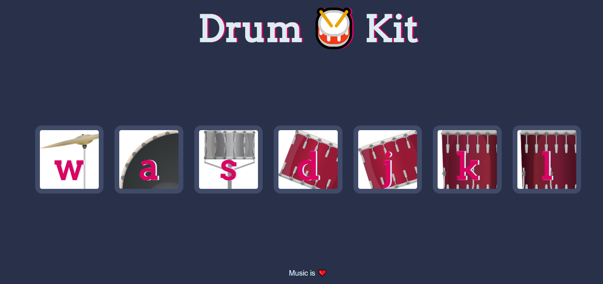
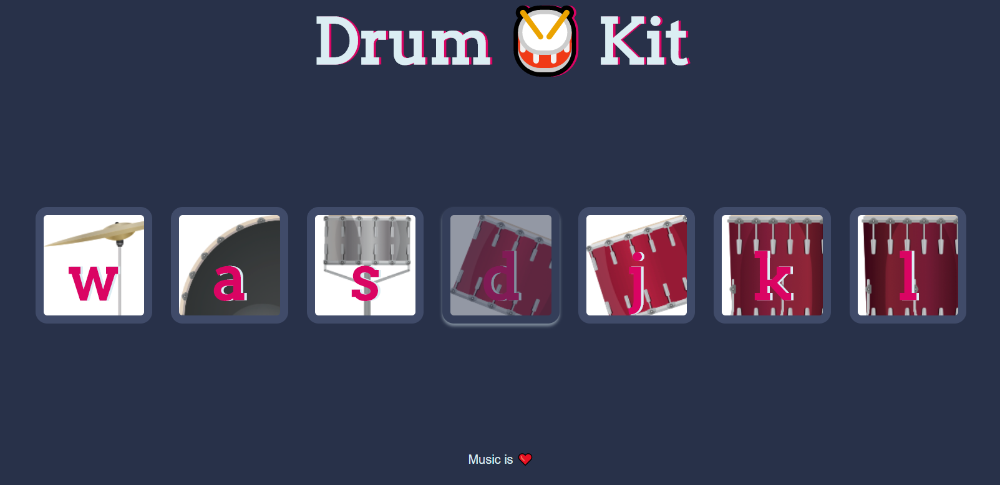

# Drum-Kit
A basic website that uses HTML, CSS and JS to create drum sounds on a click. Follow the link to roll on the drums - https://m10hit.github.io/Drum-Kit/

# About Drum-Kit
A website where a user can use mouse or keyboard buttons to play different sounds of the drums. Each drum has a different sound and the user also gets an indication of which drum gets played.

# Tools Used
Used JS event handlers, animations and audio files for the drum sound. Also used HTML5 and CSS3.

# Screenshots

